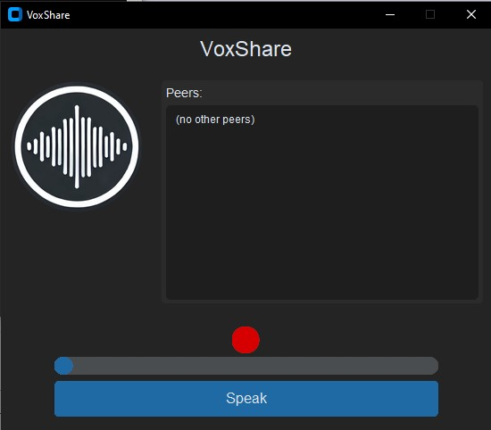

# VoxShare

**VoxShare** is a simple Python-based push-to-talk multicast voice chat application with a sleek modern GUI built using CustomTkinter.

## 📷 Screenshot



## 🎧 Features

- Voice transmission via UDP multicast
- Push-to-talk button with visual feedback
- Volume level visualization
- Custom audio input/output device selection
- Lightweight and easy to use

## 🚀 Requirements

- Python 3.8 or higher
- Dependencies:
  - `customtkinter`
  - `sounddevice`
  - `numpy`
  - `Pillow`

Install all dependencies with:

```bash
pip install -r requirements.txt

