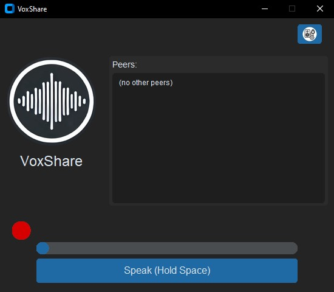

# VoxShare

**VoxShare** is a simple Python-based push-to-talk multicast voice chat application with a sleek modern GUI built using CustomTkinter.

[](https://replit.com/new/github/eugenyh/voxshare)

---

## 🎧 Features

- Voice transmission via UDP multicast
- Push-to-talk button with visual feedback
- Volume level visualization
- Custom audio input/output device selection
- Lightweight and easy to use

## 🚀 Requirements

- Python 3.8 or higher
- Dependencies:
  - `customtkinter`
  - `sounddevice`
  - `numpy`
  - `Pillow`

Install all dependencies with:

```bash
pip install -r requirements.txt
```

## 🔧 How it works

1. **Audio Input**: VoxShare captures audio from the selected microphone in real-time.
2. **Push-to-Talk**: Audio is transmitted only while the push-to-talk button is held down.
3. **Multicast UDP**: Audio packets are sent over a multicast UDP channel to all clients in the local network.
4. **Volume Meter**: A volume meter displays your current speaking volume.
5. **Audio Output**: Received audio packets are played through the selected output device.
6. **Client Discovery**: Clients periodically broadcast small `PING` packets to detect active peers.

## 📷 Screenshot



## ▶️ Usage

```bash
python voxshare_gui_XXX.py
```

1. Select your microphone and speaker.
2. Press and hold the circular button to talk.
3. Speak into your microphone and release when done.

## 🤝 Contributing

Contributions are welcome! Feel free to fork this repo and submit pull requests. Please make sure your code follows PEP8 standards and is well-documented.

## 📄 License

MIT License. See `LICENSE` file for details.

---

Made with ❤️ by [EugenyH](https://github.com/eugenyh)
